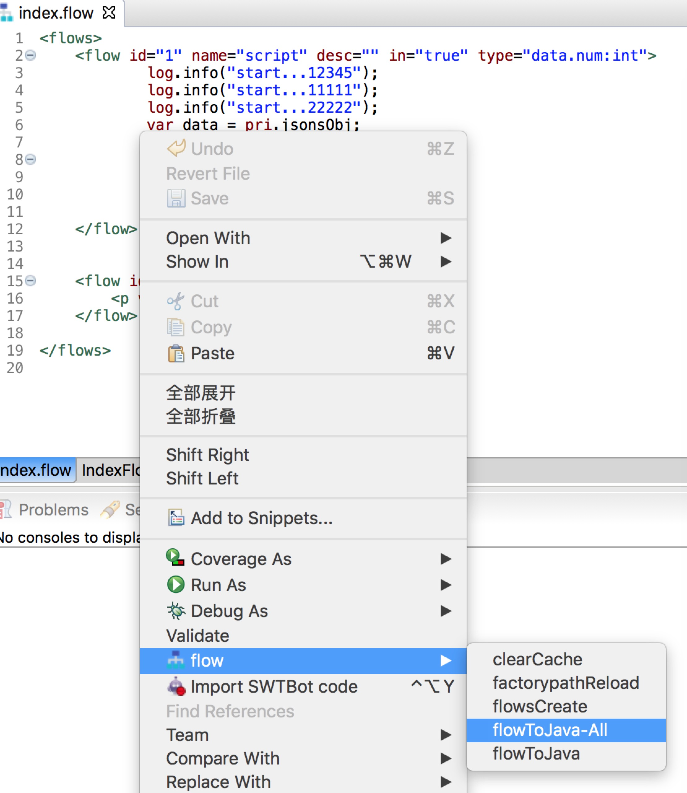
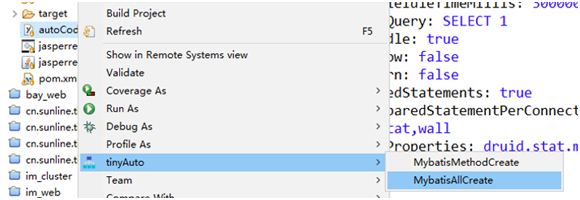
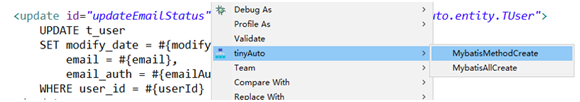

#  **tinyserver2 user manual**					
					
## 1. **start quickly**					
before start the project，you must install jdk1.8+,maven3.5+,eclipse4.8+.<br/>					
after install the software，please remember to set system environment variables for jdk, maven。					
		
#### start up project					
					
after create project catalog successfully，can cd to application catalog					
					
> command line ：					
```bash					
cd proejct_name					
mvn spring-boot:run 					
```					
					
> eclipse下:					
```					
Call the main function of cn. sunline. tiny. Application to start up					
```					
					
If there are exceptions, make sure that the Maven installation is successful and that the Maven is added to the system environment variable					
					
#### Local preview validation					
					
- browser view : http://127.0.0.1:8000/test_sample.tml					
- verification result : {"code":"0","msg":"I'm an introductory example of tinysever 2.1"}							
					
#### Compile all flows as Java classes					
					
* command line：					
mvn tiny:tinypackage realize all flow-to-java transformations					
					
* ide下：					
					
					
* debug=true					
Setting debug = true in config. properties ，enables real-time conversion of accessed flows					
					
## 2. **how to use**					
					
### 2.1 flow component					
					
#####  custom component development					
* Extends base class Basecomponent					
* component annotations, managed by spring					
* Implement interface method *public int doControl(Context ct, FlowInfo flowInfo);* 	<br/>					
    floInfo is the specific XML sub-node information in the node				
    Ct is the application context, you can get the public pool (pub) and private pool (pri) from ct					
```java					
@Component("comp_demo")					
public class CompDemo extends Basecomponent{					
					
	private static final  Logger LOG  =  LoggerFactory.getLogger(CompDemo.class );				
					
	@Override				
	public int doControl(Context ct, FlowInfo flowInfo) {				
		LOG.debug("start....");			
		Map<String,Object> map = this.getByNameAndValue(ct, flowInfo);			
		LOG.debug("map:"+map);			
		/////////specific business logic/////////			
		//result			
		ct.getPriDataCache().put("result","hello compDemo");			
		return 0;			
	}				
}					
```					
```xml					
<flow id="100" name="comp_demo" succ="110">					
		<p name="param1" value="conf.debug" />			
		<p name="param2" value="test" />			
</flow>					
```					
the name = "comp_demo" is the name defined in the annotation Component.					
					
#### view component					
view components are primarily designed to return view information					
1. return json message					
```xml					
<flow id="10" name="view">					
    {					
        "code":"0000",					
        "msg":"success"					
    }					
</flow>					
```					
2. redirection					
```xml					
<flow id="redirect_2" name="view">					
    <p value="redirect:view.tml?flow=redirect_3"/>					
</flow>					
```   					
3. return complex json message 					
```xml					
<flow id="list_2" name="view">					
    var jsons = {};					
    jsons.rows=[];					
    pri.list.forEach(function(o){   					
        jsons.rows.push(o);					
    });  					
    return jsons;					
</flow>					
```					
										
#### script component					
You can write a flowscript script in this component.					
for example：					
```xml					
<flow id="1" name="script" in="true">					
    pri.name = "yu";					
    //queryList Query List Data					
    pri.list = dao.queryList("select name,age from user where name like ?",pri.name);					
    log.info("list:"+pri.list);					
    if(pri.list.size()==0){					
        pri.view="no data";					
    }else{					
        return 10;					
    }					
</flow>					
```					
					
#### pub deal with component					
##### the use of pubSet					
```xml					
<flow id="10" name="pubSet" succ="15">					
<p name="mobile" value="pri.mobile" />					
<p name="page.num1" value="pri.num" />					
<p name="page.num2" value="pri.num" />					
</flow>					
```					
name is the variable name stored in pub, value is the value stored in pub.name					
					
##### the use of pubClear					
```xml					
<flow id="20" name="pubClear" succ="30">					
<p name="mobile"  />					
<p name="page" />					
</flow>					
```					
name is the key value in the pub to be clearedname.					
Specific flow can be viewed [test_pub.flow](http://p.mtiny.cn:8000/yujian/tinydemo2/blob/master/one/tinydemo/src/main/resources/flow/test_pub.flow)					
										
					
#### method component					
platform encapsulation general method into [FlowUtil class](http://p.mtiny.cn:8000/littlelili/tinydemo/blob/master/flowutil.md)，<br/>					
Project usage can be achieved through util in flowscript.method calls methods in FlowUtil；<br/>					
such us doubleToInt,getIP,httpGet,httpPost,reSessionId ，etc<br/>					
					
#### show pictures					
* component name:imageShow					
* parameter: path=picture paths to be displayed					
* examples: 					
```xml					
<flow id="10" name="imageShow">					
    <p name="path" value="pri.path"/>					
</flow>					
```					
#### pile upload					
* component name: fileUpload					
* paramete:					
    　- name="uploadPath"  request document input name					
        - value="pri.uploadPath"  file storage catalog					
        - def="upfilename"　the return information of json，including the new name of the document {"newFileName":xxxx}					
* examples：					
```xml					
<flow id="2" name="fileUpload" succ="10" fail="999">					
	<p name="uploadPath" value="pri.uploadPath" def="upfilename" />				
</flow>					
```					
* code reference					
[test_upload.flow](http://p.mtiny.cn:8000/yujian/tinydemo2/blob/master/one/tinydemo/src/main/resources/flow/test_upload.flow)					
					
### 2.2 filter					
  1. brief introduction:tinyServer built-in filters, processed before flow execution.					
  2. principle: call each filter in turn before flow, and each filter returns successfully before calling flow process.					
  3.specific :					
    - usage:In the tinyFilter.xml configuration corresponding to practical filters, such as `<filter type= "TML" >xssFilter</filter>`, the type for TML or HTML request filter					
    - your own personalized filter:					
        * inherit BaseFilter，implementation method public FilterResult doControl(Context ct, HttpServletRequest request) {					
        * spring annotations, such as: @Component ("xssFilter"), where the column sub-xssFilter is the specific filter name of the tinyFilter.xml column configuration    					
  4. Common filters:					
    - tmlServerSessionTimeOutFilter: Filters for user login and session timeout under TML  					
    - xssFilter:  attack filter for xss   					
    - sqlFilter: key word filter for sql					
    - ipFilter: IP filtering for specific transactions					
    - checkFilter: verify the total length of all parameters and determine the type of parameters by security configuration    					
    - roleFilter: setting privilege filtering for administrator applications     					
    - signFilter: tamper-proof filter for request parameters 					
  5. custom filter development:					
    - inherit parent class:BaseFilter  					
    - class annotation:@Component("fielt name")					
    - implement method:					
      public FilterResult doControl(Context ct, HttpServletRequest request)					
    - return:success-FilterResult.SUCCESS，fail-others FilterResult					
					
### 2.3 log format					
					
  1. brief introduction:support the formatting of logs and the same formatting printing of session ID or other variables,					
  2. principle：through filter interception, session Id equivalents are unified in ThreadContext, log4j2. XML can directly obtain the corresponding value.					
  3. specific:					
    - LogModFilter					
        * implement interface javax.servlet.Filter					
        * key code ThreadContext.put("sessionId", sessionId); 					
        * key code ThreadContext.clearAll();					
        specific reference [LogModFilter](http://p.mtiny.cn:8000/yujian/tinydemo2/blob/master/one/tinydemo/src/main/java/cn/sunline/tiny/LogModFilter.java)					
					
    - intergrated LogModFilter					
        ```java					
        @Bean					
        public FilterRegistrationBean someFilterRegistration() {					
            FilterRegistrationBean registration = new FilterRegistrationBean();					
            registration.setFilter(logModFilter());					
            registration.addUrlPatterns("/*");					
            registration.setName("logModFilter");					
            return registration;					
        }					
        @Bean(name = "logModFilter")					
        public Filter logModFilter() {					
            return new LogModFilter();					
        }					
        ```    					
        specific reference [LogModFilter](http://p.mtiny.cn:8000/yujian/tinydemo2/blob/master/one/tinydemo/src/main/java/cn/sunline/tiny/Application.java)					
					
    - log4j2.xml					
    ```xml					
    <PatternLayout pattern="[%d{yyyy-MM-dd HH:mm:ss}][%p][%l][%t][%X{sessionid}] %m%n"/>					
    ```					
    specific reference [log4j2.xml](http://p.mtiny.cn:8000/yujian/tinydemo2/blob/master/one/tinydemo/src/main/resources/log4j2.xml)					
					
					
### 2.4 **database operation**					
#### tinyjdbc					
1. brief introduction :tinyjdbc for database operations					
2. principle:based on the encapsulation of springjdbc					
3. specific:pls see the examples：					
    - flow script useage of component:					
        dao.queryList(sql,param1);//query list<br/>					
        dao.exeSql(sql,param1);//implement update,insert,delete					
    - java use in code：					
        TinyJdbcDao dao = BeanFactory.getBean(Constant.TINYJDBCDAO);<br/> 					
        dao.queryList(sql,param1);//query list					
    - Dependencies need to be added in pom. xml					
    ```xml					
    <dependency>					
        <groupId>cn.sunline.tiny</groupId>					
        <artifactId>tiny-boot-starter-jdbc</artifactId>					
    </dependency>					
    ```    					
#### mybatis					
  1. brief introduction:tinyserver intergrated mybatis					
  2. peinciple: based on the encapsulation of springjdbc					
  3. specific:pls see the examples					
    - add DataSourceConfig configuration					
    ```java					
    @Bean					
    public SqlSessionFactory sqlSessionFactory(DataSource dataSource) {					
        //TinyMapper dynamic generation through IDE					
        return TinyMapper.getSqlSessionFactoryBean(dataSource);					
    }					
    ```					
    and @MapperScan(basePackages= {"corresponding package name"})					
					
    - mybatis-config.xml					
    add mybatis-config set					
    [mybatis-config.xml](http://p.mtiny.cn:8000/yujian/tinydemo2/blob/master/one/tinydemo/src/main/resources/mybatis-config.xml)					
					
    - code reference					
    [DataSourceConfig.java](http://p.mtiny.cn:8000/yujian/tinydemo2/blob/master/one/tinydemo/src/main/java/cn/sunline/tiny/DataSourceConfig.java)					
    -Dependencies need to be added in pom. xml					
    ```xml					
    <dependency>					
        <groupId>org.mybatis.spring.boot</groupId>					
        <artifactId>mybatis-spring-boot-starter</artifactId>					
        <version>1.1.1</version>					
    </dependency>					
    ```					
  4. mybatis supporting code generation					
    * code generator					
    plug-ins using eclipse tinyServer2 (install address http://www.mtiny.cn/ide2/update) according to the database, the corresponding service mapper (dao), entity, XML are automatically generated, and the existing files are merged.					
					
					
    * method generation					
    tinyServer2 for the new method in the XML file, mapper method and service method to generate the corresponding flow, can directly call.		

					
					
    * Usage mode 					
    the specific use method follows the use method of mybatis.					
					
#### database field encryption					
For tinyjdbc and mybatis, they have their own database parameter encryption schemes to achieve the same effect. They are:tinyjdbc（TbsDbSec.java）、mybatis（MyInterceptor.java）<br/>					
On the switch side, it is also controlled by the fields in config.properties：<br/>					
db_sec.enable whether to turn on database encryption<br/>					
db_sec.fields the field names to be encrypted in the database are named as userNameOne, filtered as (user_name_one) by tinyjdbc, and unchanged by mybatis.（userNameOne）<br/>					
					
#### database Audit					
for mybatis，add the function of data modify audit，When insert, update, delete, record the corresponding SQL statement execution parameters, etc.<br/>					
execution class：MyInterceptor.java，save table t_tiny_record					
					
### 2.5 exception handling					
  1. Error handling:					
  In the process of requesting access to the unknown abnormal, directly attributed to the inherited do Exception method of ExceptionFun Tools, as a unified treatment of return.					
  2. specified return code processing:					
  When interruption occurs in the request access process, it needs to be returned directly to the front-end specific return code. <br/>					
  1）the return method returnFun is executed directly in flow, and then returned <br/>  					
  2）Custom run exceptions in other Java code, such as ExtRunTime Exception（custom exceptions） or UnexpRunTime Exception（Unknown exception such as third party）, are handed over to Tools for doException processing.					
					
### 2.6 timer					
  1. brief introduction:timer processing					
  2. principle:adopt the Scheduled to achieving spring					
  3. specific:pls see the examples					
    ```java					
    @Component					
    public class ScheduledTasks {					
        private static final Logger LOG = LoggerFactory.getLogger(ScheduledTasks.class);					
					
        private static final SimpleDateFormat dateFormat = new SimpleDateFormat("yyyy-MM-dd HH:mm:ss");					
					
        @Scheduled(fixedRate = 5000)					
        public void reportCurrentTime() {					
            //heartbeat					
            LOG.debug("run time：{}",dateFormat.format(new Date()));					
        }					
    }					
    ```					
    After starting the project, the "run time:" log is output every five magic times					
					
## 3. **configuration the document**					
### 3.1 **config.properties**					
#### 3.1.1 config split					
config support to merging the parameter configuration of config.properties and config_*.properties，<br/>					
In this way, some fixed configurations can be written to the former, the latter mainly stores dynamic information such as ip, which exists in each environment, which is easy to write and maintain.。					
#### 3.1.2 Internal parameters:					
    * debug=true/false : true is debug mode, it will turn on dynamic fscript to Java function, timer updates class loader, so debug = false is necessary in production.					
    * flowjs_xx=yyy: the spring component class written by myself can be used in flow and needs to be configured. XXX is the use name, YYY is the name of the specific spring annotation.；					
    * html_folder: html_folder attribute is not configured. View component in development environment finds b.html file html_folder=null from static/html/. View component in development environment finds b.html file html_folder=url from static/down. View component in development environment finds b.html file dd from static/a/down.					
					
### 3.2 **application.yml**					
#### 3.2.1 Supporting additional application_xx.xml：					
```yml					
spring:					
  profiles:					
    active: xx					
```					
#### 3.2.2 Application Port Configuration:					
```yml					
server:					
  port: 8000					
```  					
#### 3.2.3 database configuration:					
```yml					
spring:					
   datasource:					
    driver-class-name: com.mysql.jdbc.Driver					
    url: jdbc:mysql://127.0.0.1:3306/demo?useUnicode=true&characterEncoding=UTF-8					
    username: root					
    password: root					
    initialize: true					
    type: com.alibaba.druid.pool.DruidDataSource					
    initialSize: 1					
    minIdle: 1					
    maxActive: 5					
    maxWait: 60000					
    timeBetweenEvictionRunsMillis: 60000					
    minEvictableIdleTimeMillis: 300000					
    validationQuery: SELECT 1					
    testWhileIdle: true					
    testOnBorrow: false					
    testOnReturn: false					
    poolPreparedStatements: true					
    maxPoolPreparedStatementPerConnectionSize: 20					
    filters: stat,wall					
    connectionProperties: druid.stat.mergeSql=true;druid.stat.slowSqlMillis=5000					
```					
					
### 3.3 **pom.xml**					
#### 3.3.1 parent lead in					
```xml					
<parent>					
		<groupId>cn.sunline.tiny</groupId>			
		<artifactId>tiny-boot-starter-one-parent</artifactId>			
		<version>2.1.0-SNAPSHOT</version>			
	</parent>				
```					
The current maximum version is2.1.0-SNAPSHOT 					
#### 3.3.2 Introduction of company Maven warehouse					
```xml					
<repositories>					
		<repository>			
			<id>sunline-tiny</id>		
			<name>sunline</name>		
			<url>http://p.mtiny.cn:8099/repository/maven-snapshots/</url>		
		</repository>			
</repositories>					
```					
#### 3。3.3 profiles					
Using profiles solution to support the packaging of configuration files in different environments					
* Configuring multiple environments profile					
```xml					
<profiles>					
	    <profile>				
	        <!--development environment -->				
	        <id>dev</id>				
	        <properties>				
				<environment>dev</environment>	
	        </properties>				
	        <activation>				
	            <activeByDefault>true</activeByDefault>				
	        </activation>				
	    </profile>				
	    <profile>				
	        <!-- Tencent Cloud Test Environment -->				
	        <id>sit</id>				
	        <properties>				
				<environment>sit</environment>	
	        </properties>				
	    </profile>				
	     <profile>				
	        <!-- Tencent Cloud Test Environment -->				
	        <id>uat</id>				
	        <properties>				
				<environment>uat</environment>	
	        </properties>				
	    </profile>				
	</profiles>				
```					
* The path ${environment} of the configuration package file is dynamically passed in at packaging time					
```xml					
<build>					
		<resources>			
			<resource>		
				<directory>src/main/resources/environment/${environment}</directory>	
				<targetPath>${project.build.directory}/${project.build.finalName}/WEB-INF/classes</targetPath>	
			</resource>		
			<resource>		
				<directory>src/main/resources</directory>	
				<excludes>	
					<exclude>environment/**</exclude>
				</excludes>	
			</resource>		
		</resources>			
		<finalName>xxxx</finalName>			
		<directory>${project.basedir}/target</directory>			
		<outputDirectory>${project.build.directory}/${project.build.finalName}/WEB-INF/classes</outputDirectory>			
        <plugins>					
			<plugin>		
				<groupId>org.apache.maven.plugins</groupId>	
				<artifactId>maven-compiler-plugin</artifactId>	
				<version>3.1</version>	
				<configuration>	
					<source>1.8</source>
					<target>1.8</target>
					<useIncrementalCompilation>true</useIncrementalCompilation>
					<warSourceExcludes>src/main/resources/**</warSourceExcludes>
				</configuration>	
			</plugin>		
			<plugin>		
		    	<groupId>org.apache.maven.plugins</groupId>		
			    <artifactId>maven-war-plugin</artifactId>		
			    <configuration>		
			        <warName>xxxx</warName>		
			    </configuration>		
			</plugin>		
		</plugins>			
</build>					
```					
Execute when packing<br/>					
mvn clean install -Dmaven.test.skip=true -Pdev  <br/>					
Dev refers to the dev environment, corresponding to the ${environment} parameter configured above.					
					
### 3.4 tinyFilter.xml					
  * Purpose: Configure the filter of tinyserver, which will be executed before the flow is executed, but not returned。					
  * <tiny>root node					
  * <filter>: The typ node is unified as tml or html, and the text value is the corresponding filter name.。					
  * specific configuration:					
  ```xml					
  <tiny>					
    <filter type="tml">tmlServerSessionTimeOutFilter</filter>					
  </tiny>					
  ```  					
					
### 3.5 tinySession.xml					
  * Purpose: Provide configuration information on whether login is required before access.					
  * <tiny>root node					
  * <url>: The method node is unified as all, and the text value is the specific flow name. After configuration, users can access it without login.					
  * specfic configuration:					
  ```xml					
  <tiny>					
  <url method="all">index</url>					
  </tiny>					
  ```					
					
## 4. **Interaction with other systems**					
    					
### 4.1 With app client					
  #### agreement					
  Provide http/https interface for app client to call					
  #### message type					
  message support the message format of jsons,form,protobuf					
  #### Data transfer					
  app to  tinyserver					
					
### 4.2 with front					
  #### agreement					
  support call rpc,socket					
  #### message type					
  Support rpc, jsons format message					
  #### data transfer					
  tinyserver to front					
					
### 4.3 with message center					
  #### agreement					
  support call rpc,http request					
  #### message type					
  support rpc,jsons message					
  #### data transfer					
  tinyserver to message center					
					
### 4.4 with management desk					
  #### agreement					
  connect the same database					
  #### message type					
  nothing					
  #### data transfer					
  nothing					
					
### 4.5 with behavioral analysis					
  #### agreement					
  based on log4j log					
  #### message type					
  based on log4j log					
  #### data transfer					
  log4j log to behaviour analysis					
					
## 5. **deploy**					
$TOMCAT_PATH:tomcat installation path<br/>					
$PROJECT:project name<br/>					
					
### 5.1 **stand-alone deployment**					
  - The war package is deployed under $TOMCAT_PATH/webapps					
  - start tomcat: $TOMCAT_PATH/bin/startup.sh					
					
### 5.2 **Cluster deployment**					
  - nginx: 					
    -  F5 does load balancing, nginx only acts as forwarding agent					
    ```					
    location /app {					
        proxy_pass   http://app_server/app;					
        client_max_body_size 6M;					
            proxy_cookie_path /app     /app;					
            proxy_set_header Host $host;					
            proxy_set_header X-Real-IP $remote_addr;					
            proxy_set_header REMOTE-HOST $remote_addr;					
            proxy_set_header X-Forwarded-For $proxy_add_x_forwarded_for;					
    }					
    # app corresponds to the name of the access, app_server corresponds to the domain name or IP of the server					
    ```     					
    - nginx for load balancing:					
    ```					
    upstream app_server {					
      server ip1:port1;					
      server ip1:port1;					
    }					
    location /app{					
        # the same as above, but the app_server at this time corresponds to the cluster configured in upstrarm app_server {}					
    }					
    ```    					
  - tomcat: same as stand-alone deployment					
  - code: need add the support springboot to redis					
  - redis: need redis server,provide uniform storage for server session					
       					
### 5.3 **start-stop script**					
  * development:					
    - command line: start: mvn spring-boot:run ,stop: ctrl+c					
    - eclipse: start: operate the function of Application.javamain ,stop:close button under console					
  * tomcat: 					
    - start: $TOMCAT_PATH/bin/startup.sh					
    - stop: $TOMCAT_PATH/bin/shutdown.sh					
					
### 5.4 **look at log**					
  1. look at the log under tomcat:$TOMCAT_PATH/logs/catalina.out					
  2. look at the configuration log under $TOMCAT_PATH/webapp/$PROJECT/WEB-INF/classes/log4j2.xml					
					
### 5.5 **port settings**					
  * the default port set in the development environment is 8000 < br/>.					
    under application.yml <br/>					
     server:<br/>					
       port: 8000 can modify port 					
  * deploy default port 8080 under Tomcat<br/>					
     config/server.xml<br/>					
     <Connector port="8080" protocol="HTTP/1.1" can modify port					
					
### 5.6 project package					
#### full package					
##### create a new project configuration catalog					
mkdir /opt/dir/version/tinydemo					
					
##### add the configuration document					
vi /opt/dir/version/tinydemo/tiny_version.config<br/>					
file content：<br/>					
name=tinydemo <br/>					
version=2.1.0 <br/>					
desc=demo project <br/>					
vcs_path=http://p.mtiny.cn:8000/yujian/tinydemo2 <br/>					
vcs_version=ebdf7011de5086c357e3168fc22753f66817ad5e <br/>					
files=all <br/>					
					
** remark： <br/>					
version type out the corresponding version number<br/>					
vcs_path paths corresponding to git or SVN<br/>					
vcs_version corresponding git or version number in SVN<br/>					
files=all represents a full package.<br/>					
###### execution command packaging					
cd to the project root catalog<br/>					
mvn clean package -o -Dmaven.test.skip=true -Dtinypath=/opt/dir/version/tinydemo<br/>					
#NAME?					
					
#### Incremental packing					
##### create a new project configuration catalog					
mkdir /opt/dir/version/tinydemo					
					
##### add configuration file					
vi /opt/dir/version/tinydemo/tiny_version.config<br/>					
file content：<br/>					
name=tinydemo <br/>					
version=2.1.0 <br/>					
desc=demo project <br/>					
vcs_path=http://p.mtiny.cn:8000/yujian/tinydemo2 <br/>					
vcs_version=ebdf7011de5086c357e3168fc22753f66817ad5e <br/>					
files=catalog path to be packaged<br/>					
					
** remark： <br/>					
files=you need to configure the corresponding incremental source catalog					
					
#####  execution command packaging					
mvn clean package -o  -Dmaven.test.skip=true -Dtinypath=/opt/dir/version/tinydemo <br/>					
If plug-ins and dependency packages are not downloaded, the - O parameter cannot be brought with them.					
